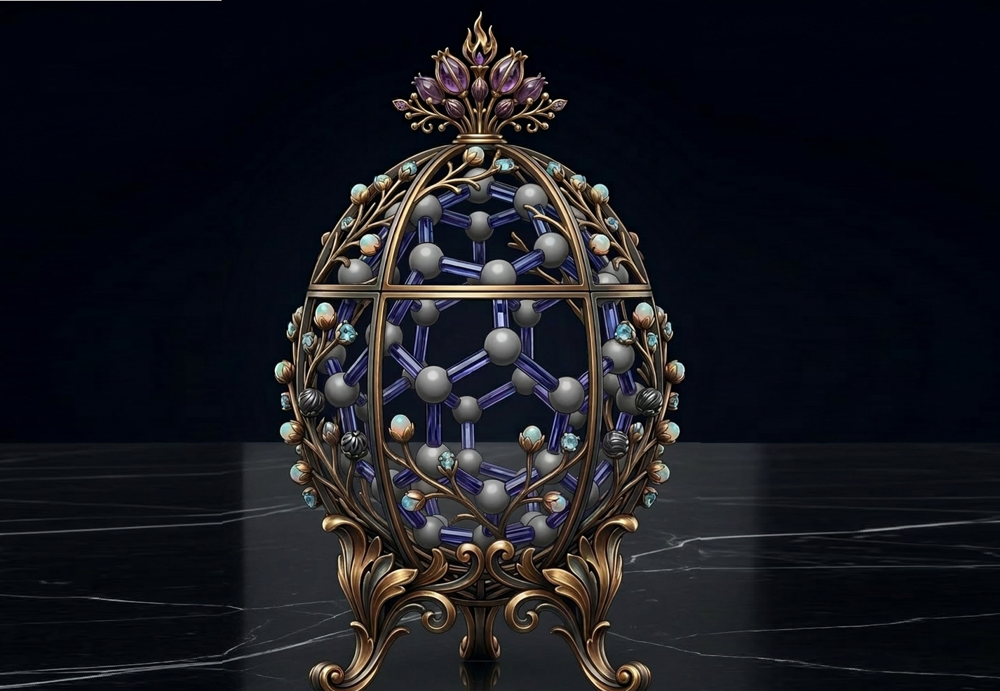

# On the Dynamic Catching of Fullerenes: Evolution and Enhanced Fullerene Binding of Dual Cavity Hosts

  

---
This repository contains the computational setup files, structural trajectories, and analysis data.

## 📁 Repository Structure and Content Reference

### `xtb_md/`
This folder encompasses the raw structure coordinate states and inputs required to execute the GFN2-xTB dynamics:
* `md.inp`: Input file specifying the parameters for the molecular dynamics simulation.
* `C60_1host_input.xyz` & `C70_1host_input.xyz`: Starting coordinate layouts depicting the uncomplexed setups.
* `C60_1host_xtb.xyz` & `C70_1host_xtb.xyz`: Final coordinate trajectory files generated at the end of production.
* **`movie/`**: Contains `C60.mp4` and `C70.mp4` video files animating the visual step-wise encapsulation and internal precession/rotation of fullerenes inside the nanoglove cavity.

### `Analysis/`
This folder contains the quantitative tracking data of the dynamic host-guest processes:
* `C60_Centroides.txt` & `C70_Centroides.txt`: Extracted distance values tracking intercentroid trajectories over time.
* `MD+EDA_C60.txt` & `MD+EDA_C70.txt`: Raw data files documenting the evolution of the different energy terms ($\Delta E_{int}$, $\Delta E_{Pauli}$, $\Delta E_{elstat}$, $\Delta E_{orb}$, and $\Delta E_{disp}$) along the trajectory.
* **`cub/`**: Gaussian cube files containing the electron spatial data used to construct the surfaces.
  * `C60/` & `C70/`: Subfolders containing potential profiles (`*_Coulpot.cub`) and density distributions (`*_Density.cub`) for the complexes.

